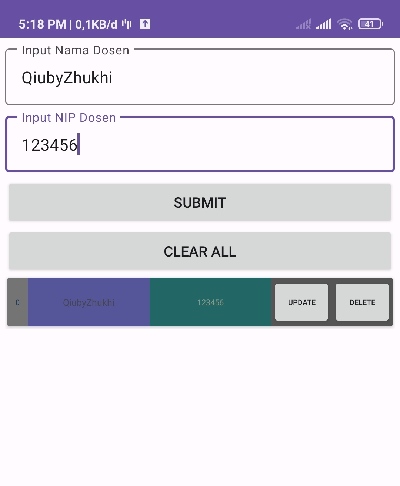

# CRUD
CRUD Singkatan Dari CREATE, READ, UPDATE, DELETE adalah Pengetahuan dasar yang dipelajari untuk menangani pembuatan, membaca, memperbaharui dan menghapus item pada database.

# Tentang Aplikasi

Aplikasi ini saya buat sebagai Tambahan koleksi direpository saya, sekaligus untuk sebagai referensi bagi teman - teman yang mau belajar CRUD dan belajar menggunakan viewbinding pada RecyclerView.

Silahkan cek _**Release_** untuk mendapatkan Contoh Aplikasinya.

